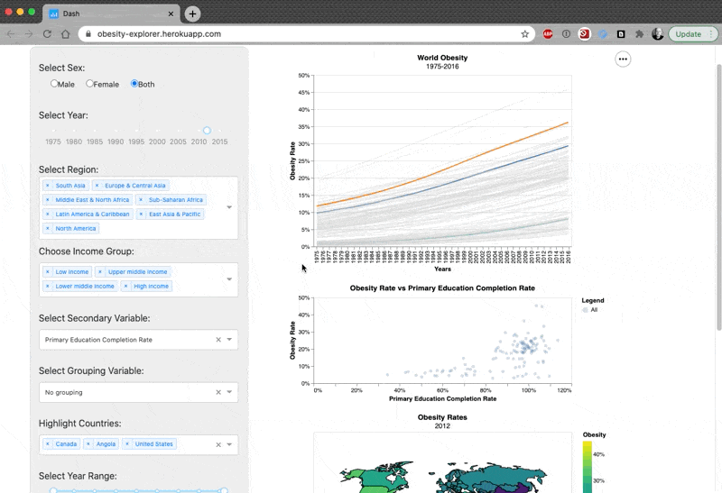

# Obesity Explorer

Authors: Dustin Burnham, Javairia Raza, Rafael Pilliard Hellwig, Tanmay Sharma

## Using the Obesity Dashboard

Obesity has been an increasing medical concern across the world in the 21st century. 
It is a medical precursor to diseases such as diabetes, heart diseases, high blood pressure and certain types of cancers. 
In spite of this, most people know very little about this disease, and are unaware of the factors that increase its relative risk. 
To increase awareness and deepen understanding, this [Obesity Dashboard](https://obesity-explorer.herokuapp.com/) allows users to explore obesity trends, probe associations with other variables and factors, and discover patterns related to this global epidemic.

[](https://obesity-explorer.herokuapp.com/)

## Contributing to the Dashboard

We love contributions! If you wish to help with this project or find a bug, please first review our [contributing guidelines](CONTRIBUTING.md).
Contributors are encouraged to clone the repository and [install the conda environment](https://docs.conda.io/projects/conda/en/latest/user-guide/tasks/manage-environments.html) from the project root:

```bash
conda env create -y -f obesity.yaml
conda activate obesity
```

The app can then be run locally from the project root via:

```bash
python src/app.py
```

The authors implement apps in both Python and R using the Dash framework. 
Details of the author's vision can be found in the [proposal document](https://github.com/UBC-MDS/obesity-explorer/blob/main/doc/proposal.md).
